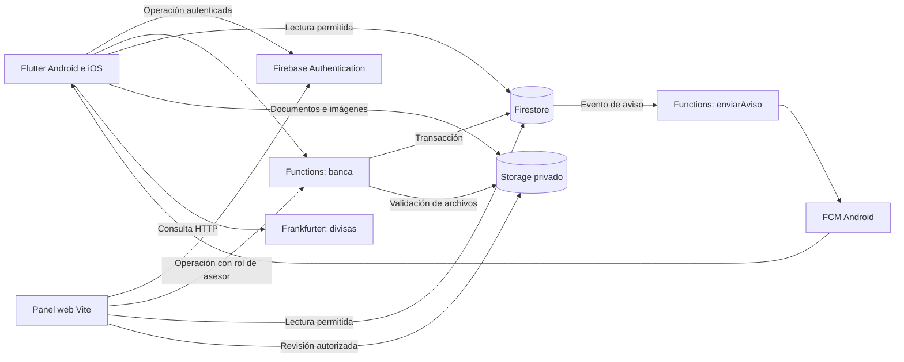
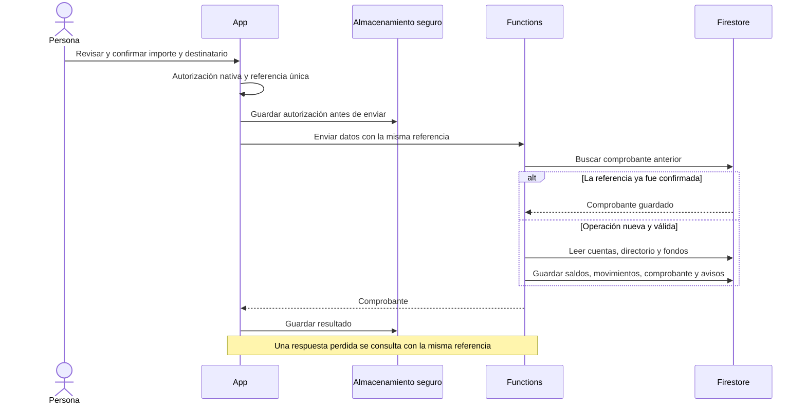
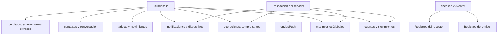

# Arquitectura

FinanceBro tiene dos clientes, Flutter y un panel web, y un servidor común en Firebase. El servidor confirma las operaciones monetarias. Los clientes consultan el resultado y actualizan sus vistas mediante Firestore.

## Componentes

Authentication identifica la sesión. Las reglas limitan las lecturas y escrituras de los clientes. Functions usa Admin SDK, que no está sujeto a esas reglas; por eso vuelve a comprobar identidad, rol y datos antes de modificar fondos.

## Cliente Flutter

| Directorio | Responsabilidad |
| --- | --- |
| `lib/app/` | Dependencias, proveedores Riverpod, rutas GoRouter y temas |
| `lib/core/` | Conexión, errores, transporte de Functions y componentes comunes |
| `features/auth` | Registro, contrato, sesión y saludo recordado |
| `features/accounts` | Resumen de cuentas, saldos y movimientos |
| `features/banking` | Transferencias, cola segura, contactos, tarjetas, crédito y cheques |
| `features/experience`, `savings` | Contenido remoto, preferencias y metas |
| `features/exchange`, `notifications` | Consulta externa de divisas y avisos |

Riverpod permite compartir estado y sustituir dependencias en las pruebas. GoRouter identifica cada cuenta, tarjeta y contacto en su ruta. La clave de página incluye la URI para renovar la consulta al cambiar de producto. Las pestañas cambian el contenido sin superponer la pantalla anterior; los detalles permiten regresar mediante navegación nativa.

Los históricos y contactos utilizan las interfaces de [historial.dart](../lib/features/banking/historial.dart). [proveedores_historial.dart](../lib/app/proveedores_historial.dart) conecta esas interfaces con [firebase_historial.dart](../lib/features/banking/firebase_historial.dart). Así se prueban las pantallas sin iniciar Firebase.

Cada página conserva un cursor con consulta, fecha precisa e identificador. Esto evita mezclar cuentas y perder registros con la misma fecha. La primera página escucha cambios en vivo; las páginas anteriores se acumulan sin duplicar identificadores. Algunas pantallas de productos aún consultan Firestore directamente: la separación de repositorios no está completa.

## Transferencia

Los importes se representan como centavos enteros. El servidor valida el rango USD 0,10 a USD 100, las cuentas, el destinatario y el saldo. Una transacción guarda todas las escrituras o ninguna. La referencia y la huella de los datos identifican el envío: repetirlo devuelve el comprobante; cambiar importe o destino con la misma referencia se rechaza.

La transacción también crea el evento de notificación. FCM se ejecuta después: un fallo de entrega no revierte la transferencia. La implementación está en [transferencias.js](../functions/src/dominios/transferencias.js) y [base-banco.js](../functions/src/base-banco.js). [Referencia de transacciones de Firestore](https://firebase.google.com/docs/firestore/manage-data/transactions).

## Datos

Los movimientos por cuenta y sus copias globales se escriben juntos. El panel consulta estas copias para mostrar actividad de distintas personas. La conciliación comprueba que importe, fecha y referencia coincidan. La herramienta de reparación solo crea copias ausentes desde originales verificados; no modifica saldos ni sustituye movimientos existentes.

El directorio de cuentas se consulta a través del servidor para obtener titular y estado sin revelar saldo, UID o cédula. La identidad y el domicilio se guardan en `datosPersonales`; los archivos permanecen en Storage privado.

## Servidor por dominios

[banca.js](../functions/src/banca.js) mantiene los nombres de las operaciones. [contratos.js](../functions/src/contratos.js) dirige las llamadas y [BancoBase](../functions/src/base-banco.js) comparte validación de sesión, acceso a cuentas y escritura de movimientos.

| Módulo | Casos de uso |
| --- | --- |
| [Onboarding](../functions/src/dominios/onboarding.js) | Registro, consentimiento y ahorros |
| [Transferencias](../functions/src/dominios/transferencias.js) | Destinatarios, transferencias, contactos, ajustes y pagos externos |
| [Tarjetas](../functions/src/dominios/tarjetas.js) | Débito, cupos, consumos, abonos y corte |
| [Expedientes](../functions/src/dominios/expedientes.js) | Corriente, documentos y solicitudes físicas |
| [Servicios](../functions/src/dominios/servicios.js) | Catálogo, planillas, pagos y planes mensuales |
| [Experiencia](../functions/src/dominios/experiencia.js) | Perfil, preferencias y metas |
| [Chequera](../functions/src/chequera.js) | Lotes, estados, fechas, eventos y cobro |
| [Avisos](../functions/src/avisos.js) | Dispositivos, entrega y reintentos |

Los módulos comparten despliegue y base de datos. Esta estructura permite separar responsabilidades sin romper las transacciones actuales. Para asignar un dominio a otro equipo se deben extraer sus interfaces, versionar contratos y mantener pruebas de compatibilidad. Si utiliza otra base de datos, las escrituras dejan de compartir una transacción; habría que incorporar eventos, compensaciones y conciliación entre servicios.

## Notificaciones y diagnóstico

`enviosPush` guarda los eventos confirmados. El proceso de entrega reserva un evento durante 90 segundos para evitar envíos simultáneos. Reintenta solo los dispositivos pendientes, hasta tres intentos de transporte, y retira un token inválido únicamente si no cambió desde su lectura. Un fallo tras la aceptación de FCM puede repetir un aviso; el comprobante financiero sigue siendo único.

[observacion.js](../functions/src/observacion.js) registra operación, duración, resultado, categoría de error y un identificador derivado de la referencia. No registra formularios, saldos, tokens o documentos. [Operación](operacion.md) explica cómo buscar esos eventos.

## Contenido remoto

Firestore entrega contenido con versión de esquema, segmento, orden y destino permitido. La app acepta componentes conocidos, ignora tipos desconocidos y conserva la última configuración válida. El panel puede cambiar servicios, mensajes y temporadas. Un componente nativo nuevo necesita una versión de la aplicación.

## Límites de la arquitectura actual

El servidor es un único despliegue con módulos, no un conjunto de microservicios independientes. Algunas vistas siguen acopladas a Firestore. El límite de una instancia por función restringe capacidad y debe revisarse con pruebas de carga. La caché puede contener datos privados de una sesión; una operación financiera real necesitaría una política adicional de retención y protección del dispositivo.

APNs, Wallet, proveedores bancarios, tareas periódicas y un libro contable certificado no forman parte de la integración actual. [Decisiones y alternativas](decisiones.md).
