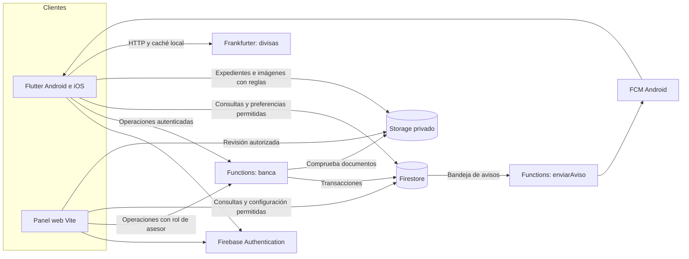
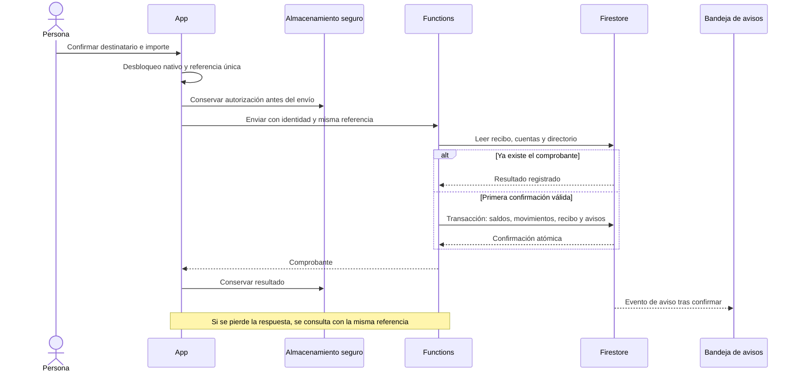
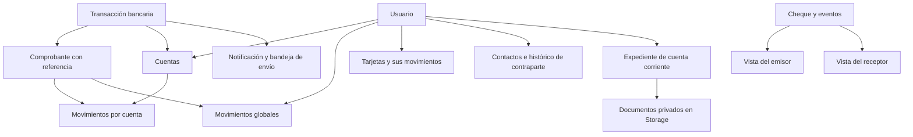

# Arquitectura de FinanceBro

FinanceBro integra un cliente Flutter, un panel de asesor y un servidor compartido. Su objetivo es que una operación tenga el mismo resultado para quien la realiza, su contraparte y administración, conservando el histórico aunque la conexión falle.

## Componentes y dependencias

Las reglas niegan escrituras directas de saldos, movimientos, cupos, aprobaciones y comprobantes, incluso desde un navegador con rol de asesor. Functions utiliza identidad y permisos comprobados en servidor. Las preferencias y determinados contenidos tienen operaciones limitadas por sus reglas. Los SDK de servidor no dependen de esas reglas: por eso su validación y la protección de sus credenciales son parte de la frontera de confianza.

## Organización del cliente

| Área | Responsabilidad | Referencia |
| --- | --- | --- |
| `app/` | Composición de dependencias, Riverpod, navegación y temas | [Proveedores](../lib/app/proveedores.dart), [rutas](../lib/app/rutas.dart) |
| `core/` | Conexión, errores, componentes visuales y acceso a Functions | [Red](../lib/core/red_banco.dart), [errores](../lib/core/errores.dart) |
| `features/auth` | Identidad, contrato y acceso recordado | [Identidad](../lib/features/auth/firebase_identidad.dart) |
| `features/accounts` | Resumen y consultas de cuentas | [Cuentas](../lib/features/accounts/firebase_cuentas.dart) |
| `features/banking` | Productos, contactos, históricos, crédito y cheques | [Cola segura](../lib/features/banking/cola_transferencias.dart) |
| `features/experience`, `savings` | Preferencias, contenido por segmento y metas | [Contrato remoto](../lib/features/experience/experiencia.dart) |
| `features/exchange`, `notifications` | Adaptadores de divisas y avisos | [HTTP](../lib/features/exchange/http_divisas.dart), [avisos](../lib/features/notifications/firebase_notificaciones.dart) |

Históricos y conversaciones usan contratos tipados de [lectura](../lib/features/banking/historial.dart). Las pantallas dependen de esos contratos; [la composición](../lib/app/proveedores_historial.dart) conecta el [adaptador Firebase](../lib/features/banking/firebase_historial.dart). Los tests sustituyen el repositorio sin iniciar Firebase. El cursor conserva consulta, identificador y precisión de segundos/nanosegundos para no mezclar productos ni saltar registros de igual fecha. La primera página utiliza el stream: presenta caché identificada y recibe el servidor sin repetir una lectura inicial.

La migración se limita a históricos y detalle de contacto. Algunas pantallas de productos todavía consultan Firestore directamente. Mantener esta deuda visible permite continuar la extracción por caso de uso. [La comprobación de límites](../tooling/comprobar-limites.mjs) en CI protege la separación ya realizada.

## Transferencia y recuperación

Se emplean centavos enteros. La transferencia se rechaza si el importe no está entre USD 0,10 y USD 100, el destinatario no coincide con el directorio, hay datos incompatibles o faltan fondos. Las transacciones mantienen consistencia entre saldo y registros; la bandeja de avisos se confirma junto con la operación. La entrega de la push es posterior y puede fallar sin revertir un dinero ya confirmado. La referencia impide un segundo descuento por reintento; no promete entrega exactamente una vez del mensaje de notificación.

## Datos e históricos

Las proyecciones por cuenta y global facilitan consultas de la app y del panel; requieren comprobar que sus copias sigan correspondiendo al original. La conciliación compara fondos e históricos. La herramienta de reconstrucción solo crea copias globales ausentes desde originales verificados, conserva procedencia y aborta ante cambios concurrentes; no corrige un saldo por inferencia.

## Dominios del servidor

`banca.js` es una fachada de compatibilidad. El catálogo de [operaciones](../functions/src/contratos.js) dirige las llamadas a casos de uso separados; [BancoBase](../functions/src/base-banco.js) reúne acceso a datos, identidad, cuentas y escritura de históricos. Las validaciones compartidas están en [compartido.js](../functions/src/compartido.js).

| Módulo | Responsabilidad |
| --- | --- |
| [Onboarding](../functions/src/dominios/onboarding.js) | Identidad de cliente, consentimiento y apertura idempotente |
| [Transferencias](../functions/src/dominios/transferencias.js) | Destinatarios, fondos, contactos, ajustes y pagos externos |
| [Tarjetas](../functions/src/dominios/tarjetas.js) | Débito, crédito, cupos, consumos, abonos y corte |
| [Expedientes](../functions/src/dominios/expedientes.js) | Corriente, documentos, aprobación y solicitudes físicas |
| [Servicios](../functions/src/dominios/servicios.js) | Catálogo, planillas, pagos y configuración mensual |
| [Experiencia](../functions/src/dominios/experiencia.js) | Metas, perfil y preferencias |
| [Chequera](../functions/src/chequera.js) | Agrupaciones, estados, eventos y cobro expreso |
| [Avisos](../functions/src/avisos.js) | Reserva de entrega, tokens pendientes y reintentos |

Esta separación permite revisar casos y ejecutar sus comprobaciones sin concentrar su implementación en la fachada. Conserva un mismo servidor, base y propietario de las escrituras monetarias: los dominios no tienen despliegues independientes. Los tests de integración verifican los resultados y permisos a través de la fachada pública.

Antes de dividir infraestructura: versionar contratos de cliente, sustituir lecturas cruzadas por interfaces y diseñar compatibilidad. Si los dominios usan bases distintas, la transacción actual no se conserva automáticamente: se requieren eventos, compensaciones y conciliación. Mantener juntas las escrituras relacionadas evita introducir esa complejidad en esta entrega.

## Entrega de avisos y diagnóstico

La bandeja de avisos reserva cada evento dentro de una transacción por 90 segundos. Las ejecuciones concurrentes no envían al mismo tiempo; una reserva abandonada permite recuperación posterior. Se intentan de nuevo solo los dispositivos pendientes, hasta tres intentos de transporte. Los tokens inválidos se retiran únicamente si no han cambiado desde la lectura, protegiendo la rotación.

Un fallo después de que FCM acepte el mensaje todavía puede repetir una entrega. La referencia del evento y la etiqueta del aviso ayudan a agruparlo en Android; el comprobante financiero sigue siendo único. Las pruebas cubren transporte parcial, concurrencia y rotación con Firestore real emulado.

[Observación de operaciones](../functions/src/observacion.js) registra versión del esquema, operación permitida, duración, resultado, categoría de error y correlación derivada de la referencia. Excluye formularios, saldos, tokens y contenidos privados. Un fallo del registrador no altera una operación confirmada. [Operación](operacion.md) describe consulta e investigación de estos eventos.

## Personalización sin reinstalar

Firestore suministra tarjetas de contenido con versión de esquema, segmento, orden y destino permitido. El cliente admite tipos conocidos, ignora tipos desconocidos y conserva la última configuración válida si una publicación es incompatible. Servicios y temporadas se administran remotamente. Esto permite variar experiencia y contenido dentro de capacidades instaladas; añadir un componente nativo nuevo necesita una publicación móvil.

## Supuestos y riesgos

- Prototipo con identidades, documentos y fondos ficticios; cédula por formato y unicidad, sin consulta a un registro oficial.
- Consultas privadas y operaciones monetarias requieren autenticación; la caché no es una confirmación de fondos disponible en el servidor.
- Firebase reduce infraestructura propia y aporta SDK móviles; concentra dependencia tecnológica y costos por consumo.
- El servidor actual limita instancias por costo. El límite no asegura ausencia de contención ni sustituye pruebas de carga.
- Firestore local puede conservar datos de la sesión en el dispositivo. Una operación bancaria real necesitaría política de retención, protección adicional y evaluación de dispositivos comprometidos.
- FCM remoto está configurado en Android. APNs, Wallet, emisión física, proveedores reales y débitos periódicos quedan fuera del alcance conectado actual.

Las [decisiones](decisiones.md) explican alternativas y compromisos; [operación](operacion.md) concreta evolución, despliegue y recuperación. La atomicidad utilizada se apoya en las [transacciones de Firestore](https://firebase.google.com/docs/firestore/manage-data/transactions).
