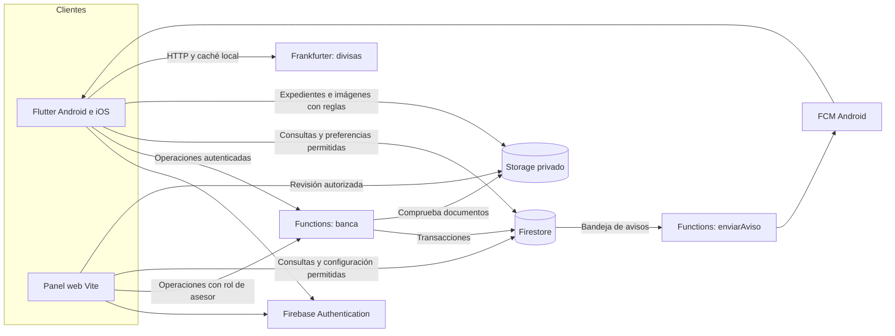
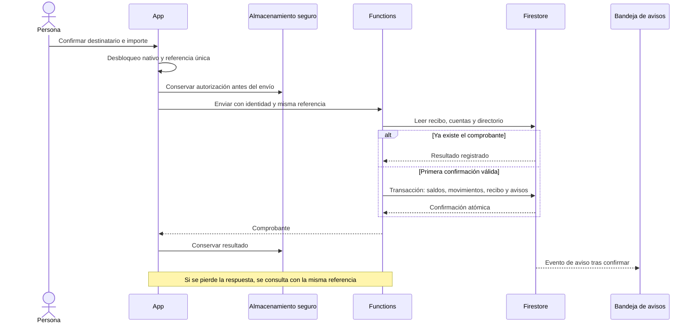
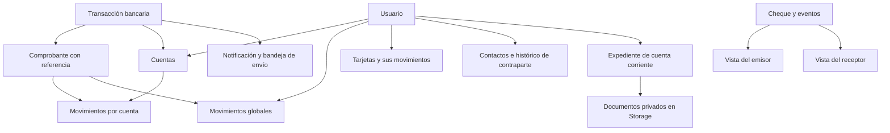

# Arquitectura de FinanceBro

FinanceBro integra un cliente Flutter, un panel de asesor y un servidor compartido. Su objetivo es que una operación tenga el mismo resultado para quien la realiza, su contraparte y administración, conservando el histórico aunque la conexión falle.

## Componentes y dependencias

Las reglas niegan escrituras directas de saldos, movimientos, cupos, aprobaciones y comprobantes, incluso desde un navegador con rol de asesor. Functions utiliza identidad y permisos comprobados en servidor. Las preferencias y determinados contenidos tienen operaciones limitadas por sus reglas. Los SDK de servidor no dependen de esas reglas: por eso su validación y la protección de sus credenciales son parte de la frontera de confianza.

## Organización del cliente

| Área | Responsabilidad | Referencia |
| --- | --- | --- |
| `app/` | Composición de dependencias, Riverpod, navegación y temas | [Proveedores](../lib/app/proveedores.dart), [rutas](../lib/app/rutas.dart) |
| `core/` | Conexión, errores, componentes visuales y acceso a Functions | [Red](../lib/core/red_banco.dart), [errores](../lib/core/errores.dart) |
| `features/auth` | Identidad, contrato y acceso recordado | [Identidad](../lib/features/auth/firebase_identidad.dart) |
| `features/accounts` | Resumen y consultas de cuentas | [Cuentas](../lib/features/accounts/firebase_cuentas.dart) |
| `features/banking` | Productos, contactos, históricos, crédito y cheques | [Cola segura](../lib/features/banking/cola_transferencias.dart) |
| `features/experience`, `savings` | Preferencias, contenido por segmento y metas | [Contrato remoto](../lib/features/experience/experiencia.dart) |
| `features/exchange`, `notifications` | Adaptadores de divisas y avisos | [HTTP](../lib/features/exchange/http_divisas.dart), [avisos](../lib/features/notifications/firebase_notificaciones.dart) |

La organización por funcionalidad evita una carpeta global de pantallas sin límites. Los repositorios abstraen consultas que conviene sustituir en pruebas. Riverpod compone los adaptadores y representa carga, datos y error. No todos los módulos tienen la misma separación: algunas pantallas bancarias consultan Firestore y `banca.js` concentra varias operaciones. Esa deuda está identificada; el proyecto no se presenta como un conjunto de microservicios con despliegues independientes.

## Transferencia y recuperación

Se emplean centavos enteros. La transferencia se rechaza si el importe no está entre USD 0,10 y USD 100, el destinatario no coincide con el directorio, hay datos incompatibles o faltan fondos. Las transacciones mantienen consistencia entre saldo y registros; la bandeja de avisos se confirma junto con la operación. La entrega de la push es posterior y puede fallar sin revertir un dinero ya confirmado. La referencia impide un segundo descuento por reintento; no promete entrega exactamente una vez del mensaje de notificación.

## Datos e históricos

Las proyecciones por cuenta y global facilitan consultas de la app y del panel; requieren comprobar que sus copias sigan correspondiendo al original. La conciliación compara fondos e históricos. La herramienta de reconstrucción solo crea copias globales ausentes desde originales verificados, conserva procedencia y aborta ante cambios concurrentes; no corrige un saldo por inferencia.

## Evolución por dominios

La siguiente separación propuesta permite asignar responsabilidades a equipos sin cambiar de inmediato toda la infraestructura:

| Dominio | Contrato y propietario de los datos | Extracción prevista |
| --- | --- | --- |
| Identidad y onboarding | Perfil, consentimiento y apertura idempotente | Servicio de alta con compensación si Auth existe y el alta bancaria falla |
| Cuentas y transferencias | Fondos, recibos y movimientos | Mantener un único propietario de las escrituras monetarias |
| Tarjetas y crédito | Solicitud, cupo, deuda y ciclo de corte | Separar reglas y casos de uso; abonos mediante contrato con cuentas |
| Chequera | Agrupaciones, eventos y estados | Orquestar cobros a través de cuentas, sin duplicar la lógica de fondos |
| Experiencia y servicios | Esquema remoto, catálogo y preferencias | Publicar contenido validado y compatible con clientes anteriores |
| Avisos | Evento y estado de entrega | Consumidor independiente que conserva la referencia del hecho bancario |

Antes de separar despliegues: versionar contratos, introducir pruebas de compatibilidad, sustituir consultas cruzadas por interfaces y extraer casos de uso de la clase bancaria. Si los dominios llegan a usar bases distintas, la transacción actual no se conserva automáticamente: habría que diseñar eventos, compensaciones y conciliación. Esa complejidad es una razón para mantener hoy las escrituras relacionadas en el mismo servidor.

## Personalización sin reinstalar

Firestore suministra tarjetas de contenido con versión de esquema, segmento, orden y destino permitido. El cliente admite tipos conocidos, ignora tipos desconocidos y conserva la última configuración válida si una publicación es incompatible. Servicios y temporadas se administran remotamente. Esto permite variar experiencia y contenido dentro de capacidades instaladas; añadir un componente nativo nuevo necesita una publicación móvil.

## Supuestos y riesgos

- Prototipo con identidades, documentos y fondos ficticios; cédula por formato y unicidad, sin consulta a un registro oficial.
- Consultas privadas y operaciones monetarias requieren autenticación; la caché no es una confirmación de fondos disponible en el servidor.
- Firebase reduce infraestructura propia y aporta SDK móviles; concentra dependencia tecnológica y costos por consumo.
- El servidor actual limita instancias por costo. El límite no asegura ausencia de contención ni sustituye pruebas de carga.
- Firestore local puede conservar datos de la sesión en el dispositivo. Una operación bancaria real necesitaría política de retención, protección adicional y evaluación de dispositivos comprometidos.
- FCM remoto está configurado en Android. APNs, Wallet, emisión física, proveedores reales y débitos periódicos quedan fuera del alcance conectado actual.

Las [decisiones](decisiones.md) explican alternativas y compromisos; [operación](operacion.md) concreta evolución, despliegue y recuperación. La atomicidad utilizada se apoya en las [transacciones de Firestore](https://firebase.google.com/docs/firestore/manage-data/transactions).
